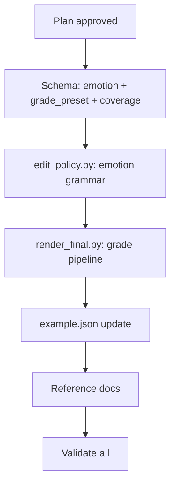

# Plan: Emotion-Driven Cinematic Editing + Color Grading + Multi-Camera Coverage

## Objective
Extend the ai-film-grok pipeline with professional-grade emotion→shot composition, multi-camera coverage planning, color grading in post, and adult-film editorial workflow documentation — matching "由情绪故事牵动镜头" (emotion story drives shots), "不同镜位的镜头组成" (multi-angle coverage), "后制调色" (color grading in post).

## Files Touched

| File | Change Type | Complexity |
|------|-------------|------------|
| `schemas/film-spec.schema.json` | Extend schema | Medium |
| `scripts/edit_policy.py` | Add emotion grammar + grade suggestion | Medium |
| `scripts/render_final.py` | Add color grading filter pipeline | High |
| `templates/film-spec.example.json` | Update examples | Low |
| `references/adult-editing-workflow.md` | **New** reference doc | Low |
| `references/emotion-shot-grammar.md` | **New** reference doc | Low |
| `scripts/film_spec.py` | Update validation for new fields | Low |

---

## Step 1 — Schema Extensions (`film-spec.schema.json`)

### 1a. New `emotion` property for shot-level emotion
Add `emotion` as an optional property on shot level with:
```json
"emotion": {
  "type": "object",
  "properties": {
    "primary": { "type": "string", "enum": ["tension", "intimacy", "lust", "passion", "melancholy", "fear", "joy", "surprise", "calm", "anger", "disgust", "anticipation"] },
    "intensity": { "type": "number", "minimum": 0, "maximum": 1 },
    "valence": { "type": "number", "minimum": -1, "maximum": 1 },
    "arousal": { "type": "number", "minimum": 0, "maximum": 1 }
  },
  "required": ["primary"]
}
```

### 1b. New `grade_preset` per shot / global
Global on film-spec root: `"grade_preset": { "enum": ["auto", "warm", "cool", "teal_orange", "desaturated", "harsh", "dreamy", "natural", "bw", "neon"] }`
Per-shot override: `"grade_preset"` on shot level.

### 1c. New `coverage` (multi-angle) per shot
Optional array of alternative camera setups:
```json
"coverage": {
  "type": "array",
  "items": {
    "type": "object",
    "properties": {
      "id": { "type": "string" },
      "viewpoint": { "type": "string" },
      "camera": {
        "type": "object",
        "properties": {
          "shot_size": { "type": "string" },
          "angle": { "type": "string" }
        }
      },
      "camera_axis": { "type": "string" },
      "motion": { "type": "string" },
      "framing": { "type": "string" },
      "emotion_intent": { "type": "string" }
    },
    "required": ["id"]
  }
}
```

---

## Step 2 — `edit_policy.py`: Emotion-Driven Shot Grammar

### 2a. New function: `emotion_to_shot_profile(emotion: str, intensity: float) -> dict`
Maps primary emotion + intensity to optimal shot grammar:
- **tension**: ECU/close-up, low angle, dolly_in, harsh grade, short shots
- **intimacy**: CU/medium, eye-level, locked/ecu_hold, warm grade, soft transitions
- **lust**: CU/insert, OTS/reverse, dolly_in, teal_orange grade, sensory motion
- **passion**: MS/MCU, handheld/low_lean, high contrast grade, smash cuts
- **melancholy**: wide/medium, pull_back, desaturated grade, long holds
- **fear**: ECU, low_angle, handheld, desaturated/harsh, smash cuts
- **joy**: MS, eye_level, pan_with, warm/natural, whip transitions
- **calm**: wide, high_angle, locked, natural, long dissolves
- **anger**: CU, low_angle, handheld/dolly_in, harsh/desaturated, smash cuts

Returns: `{shot_size, angle, camera_axis, viewpoint, grade_preset, transition_energy, motion_profile}`

### 2b. New function: `suggest_grade_preset(emotion: str | None, tone: str | None, heat_phase: str | None) -> str`
Combines emotion + tone + heat_phase → grade_preset:
- emotion dominates if present
- tone "dark" → desaturated/harsh
- heat_phase "climax" → warm/teal_orange
- heat_phase "afterglow" → dreamy/warm
- fallback: "natural"

### 2c. Extend `apply_coverage_defaults_to_shot()` to accept and use `emotion`
Currently this function already accepts an `emotion` parameter and passes it to `suggest_viewpoint()`. Extend to also:
- Set shot_size, camera_axis, viewpoint from `emotion_to_shot_profile()` when author has not explicitly set them
- Store `_emotion_used` report in coverage_defaults_applied

### 2d. Extend `suggest_edit_craft()` to incorporate emotion transitions
When emotion changes dramatically between adjacent shots (e.g., joy→anger, calm→fear), prefer smash/contrast cuts. When emotion sustains, prefer soft_glue/hold.

---

## Step 3 — `render_final.py`: Color Grading Pipeline

### 3a. New module or section: Grade Preset Definitions
Define FFmpeg filter chains for each grade preset:
```python
GRADE_PRESETS: dict[str, list[str]] = {
    "warm": [
        "colorbalance=rs=0.1:gs=-0.05:bs=-0.1",
        "eq=saturation=1.15:contrast=1.05:brightness=0.02"
    ],
    "cool": [
        "colorbalance=rs=-0.05:gs=0.0:bs=0.15",
        "eq=saturation=0.9:contrast=1.0:brightness=0.0"
    ],
    "teal_orange": [
        "colorbalance=rs=0.15:gs=-0.02:bs=0.1",
        "eq=saturation=1.2:contrast=1.1",
        "colorchannelmixer=rr=1.1:rg=0:rb=0:gr=0:gg=1.0:gb=0.05:br=0:bg=-0.1:bb=1.0"
    ],
    "desaturated": [
        "eq=saturation=0.4:contrast=1.1:brightness=-0.02",
        "colorbalance=rs=0:gs=0:bs=0.02"
    ],
    "harsh": [
        "eq=contrast=1.25:saturation=1.3:brightness=0.0:gamma=0.9",
        "colorbalance=rs=0.05:gs=-0.02:bs=-0.05"
    ],
    "dreamy": [
        "eq=saturation=0.85:contrast=0.95:brightness=0.03",
        "colorbalance=rs=0.08:gs=0.05:bs=0.05"
    ],
    "natural": [
        "eq=saturation=1.0:contrast=1.0:brightness=0.0"
    ],
    "bw": [
        "colorchannelmixer=.3:.4:.3:0:.3:.4:.3:0:.3:.4:.3",
        "eq=contrast=1.1:brightness=0.0"
    ],
    "neon": [
        "eq=saturation=1.5:contrast=1.15:brightness=0.02",
        "colorbalance=rs=0.1:gs=0.05:bs=0.15"
    ],
}
```

### 3b. New function: `build_grade_filter_chain(grade_preset: str, intensity: float = 1.0) -> str`
Builds FFmpeg filter_complex snippet for applying grade preset to a video stream.
- Returns `"eq=saturation=1.15,colorbalance=rs=0.1"` etc.
- Intensity parameter scales the effect (0.0 = bypass, 1.0 = full grade)

### 3c. Extend render pipeline
In the build_filter_graph / final_render flow:
1. After xfade composition, apply grading as a filter on the output stream
2. Read `grade_preset` from film-spec (shot-level override or global default)
3. Apply per-shot color grading where shot-level grade_preset differs from global
4. Fall back to global grade_preset when shot-level is absent

### 3d. CLI flags
`--grade-preset` (global override), `--grade-intensity` (0.0-1.0 scale)

---

## Step 4 — `film-spec.example.json` Update
- Add `emotion` object to a few shots showing different emotional states
- Add `grade_preset: "teal_orange"` to global and shot-level overrides
- Add a `coverage` array to one shot with 2-3 alternative angles

---

## Step 5 — New Reference Docs

### 5a. `references/adult-editing-workflow.md`
- Emotion arc as primary editing driver
- Multi-camera coverage: when and how to plan multiple angles
- Color grading strategy per emotion/heat-phase
- Dialogue-plot alignment: how VO and visual action must synchronize
- Post-production editorial review checklist (adult film specific)
- Rhythm & pacing: punchy vs silk vs cinematic fluency selection

### 5b. `references/emotion-shot-grammar.md`
- Reference table: emotion → shot_size, angle, camera_axis, viewpoint, motion, grade, transition
- Editorial strategies for emotion arcs (building, peaking, releasing)
- Heat arc × emotion × color grading matrix

---

## Step 6 — Validation

| Check | Command |
|-------|---------|
| JSON Schema | `python3 -c "import json; json.load(open('schemas/film-spec.schema.json'))"` |
| Python syntax | `python3 -m py_compile scripts/edit_policy.py && python3 -m py_compile scripts/render_final.py` |
| Plugin format | `grok plugin validate /Users/dex/.grok/plugins/ai-film-grok` |
| Doctor | `"$AIFILM" doctor` |
| Unit tests | `python3 -m pytest tests/ -q --tb=line` |

---

## Execution Order



Steps B-E can partially parallelize:
- Schema (B) blocks edit_policy (C) — depends on field names
- Reference docs (F) is independent — can start anytime
- render_final.py (D) depends on schema field names but not on edit_policy logic
- example.json (E) can be done after schema

## Estimated Effort
- Schema: ~30 min
- edit_policy.py: ~45 min
- render_final.py: ~90 min (main effort)
- Example + References: ~45 min
- Validation: ~15 min

Total: ~3.5-4 hours
