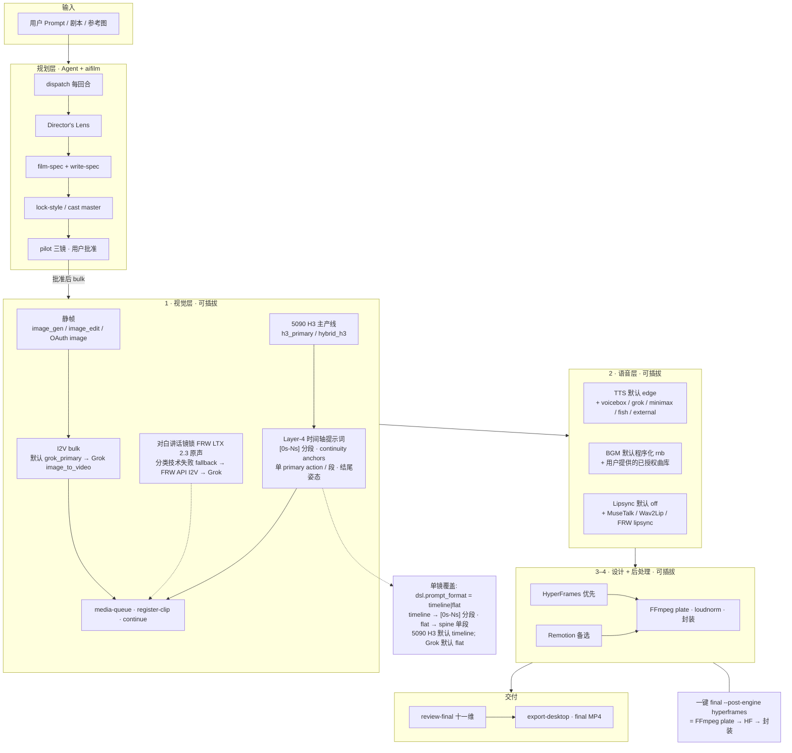

# ai-film-grok

**Grok Build 插件**：把「灵感到可验收的 AI 动态短片」收成一条**可恢复、可门禁、可插拔模型**的流水线。

- **不是**静图轮播 / Ken Burns / 只有关键帧  
- **是** I2V 真动态 + 旁白混音 + 字幕 + 十一维验收 → 可交付 MP4

| | |
|---|---|
| **版本** | **`2.40.32`**（见 [`plugin.json`](./plugin.json) · 变更 [`CHANGELOG.md`](./CHANGELOG.md)） |
| **GitHub** | https://github.com/sooneocean/ai-film-grok |
| **Gitea（个人）** | http://172.238.15.154:3000/Redredchen01/ai-film-grok |
| **Gitea（aidev）** | http://172.238.15.154:3000/aidev/ai-film-grok |
| **斜杠命令** | `/ai-film-grok` · `/aifilm` |
| **CLI** | `skills/ai-film-grok/scripts/aifilm` |
| **Agent 入口** | [`AGENTS.md`](./AGENTS.md) · skill 主脊 [`skills/ai-film-grok/SKILL.md`](./skills/ai-film-grok/SKILL.md) |
| **贡献 / 评审** | [`docs/CONTRIBUTING.md`](./docs/CONTRIBUTING.md) · [`docs/REVIEW_CHECKLIST.md`](./docs/REVIEW_CHECKLIST.md) |

---

## v2.39 本季要点（2026-08-04）

一句话：**剧本先算呈现价值 → 输入保真写进镜表 → 双轨火力拍片（Grok 铺量 + 5090 H3 攻坚）→ 空闲挑战提升画质，人审才 promote。**

| 能力 | 解决什么 | 命令 / 入口 |
|------|----------|-------------|
| **Script-value debrief** | 锁故事前先写「用户/编剧/导演/观众/生产」L0–L4 价值卡；确认 promise + 不可砍 beat | `aifilm plan debrief --action seed\|confirm\|validate` |
| **Input Fidelity** | 源句、must_keep、受保护对白是否还在成片链上；污染/实体覆盖/锚点打分 | `aifilm fidelity status\|check\|apply` · 回执 `receipts/input-fidelity.json` |
| **design-go** | debrief + fidelity + 抗无聊一页纸；**永不代签 pilot** | `aifilm design-go --root <film>` |
| **h3_primary 主产线** | 有 5090：全镜本地 H3（无限时间产能）；云 bulk 默认硬拦 | `AIFILM_I2V_PROFILE=h3_primary` · `aifilm h3 run-next` |
| **hybrid_h3 双轨** | 安全 bulk 走 Grok；肉戏/高难/对白 CU 软锁本机 MiniMax H3（5090） | `AIFILM_I2V_PROFILE=hybrid_h3` · `aifilm h3 plan\|run` |
| **FLF first+last** | 有首尾静帧时 H3 主轨优先 first+last frame；R2V 作能量位 / pose land | 有 end still 时自动 FLF；见 weapon-lane |
| **Fill-Idle 挑战** | GPU 空闲时 P0→P1→P2 挑战（不抢 P0）；多 take 只给 shortlist，**人 promote** | `aifilm h3 next\|run-next\|cycle\|pk-compare\|evidence` |
| **Layer-4 时间轴提示词** | 5090 H3 主产线自动使用 `[0s-Ns]` 分段提示词；每段独立视觉单元 | `dsl.prompt_format=timeline` 强制单镜分段；`flat` 退回 spine |
| **still-challenge** | 弱 take 可先 FRW i2i 刷更好静帧再 I2V/FLF/R2V（30s 限速；禁静默 promote） | `aifilm still-challenge plan\|run\|promote` |
| **对白优先** | 场硬闸：每场 ≥1 句 on/off_camera；对白镜画面=说话者；中文 TTS 默认 edge | 见 hard-defaults · stages/voice |

**推荐阅读顺序（agent / 维护者）**

1. 主脊：[`skills/ai-film-grok/SKILL.md`](./skills/ai-film-grok/SKILL.md)  
2. 硬表：[`references/hard-defaults.md`](./skills/ai-film-grok/references/hard-defaults.md)  
3. 火力矩阵：[`references/weapon-lane-matrix.md`](./skills/ai-film-grok/references/weapon-lane-matrix.md)  
4. 剧本价值：[`references/script-value-debrief.md`](./skills/ai-film-grok/references/script-value-debrief.md)  
5. 版本明细：[`CHANGELOG.md`](./CHANGELOG.md) → `[2.39.56]` … `[2.38.0]`

---

## 目录

1. [v2.39 本季要点](#v239-本季要点2026-08-04)
2. [安装](#安装)
3. [使用逻辑（先读这个）](#使用逻辑先读这个)
4. [架构图](#架构图)
5. [可插拔模型一览](#可插拔模型一览)
6. [最小成片路径](#最小成片路径)
7. [配置](#配置)
8. [本机开发 / 发版](#本机开发--发版)
9. [验证](#验证)

---

## 安装

### 前提

- [Grok Build](https://grok.x.ai)（或已安装 `grok` CLI 的本机环境）
- Python **3.11+**、`ffmpeg` / `ffprobe`
- 成片时建议：已 `grok login`（OAuth → `~/.grok/auth.json`），便于 Imagine / OAuth I2V / opt-in Grok TTS

### A · 从 GitHub 安装（另一台机器 / 干净环境）

```bash
grok plugin install sooneocean/ai-film-grok --trust
grok plugin enable ai-film-grok
# 之后拉更新：
grok plugin update ai-film-grok
```

TUI：`/plugins` → 选 `ai-film-grok` → `Space` 启用 · `r` 重载。

### B · 本机开发（源码即运行）

源码默认在用户插件目录（本仓绝对路径）：

```text
~/.grok/plugins/ai-film-grok
```

```bash
grok plugin validate ~/.grok/plugins/ai-film-grok
grok plugin install ~/.grok/plugins/ai-film-grok --trust
grok plugin enable ai-film-grok
# 改完源码后刷新 installed 副本：
grok plugin update ai-film-grok
```

### C · 用户 skill 路径

本机推荐：

```text
~/.grok/skills/ai-film-grok  →  symlink →  ~/.grok/plugins/ai-film-grok/skills/ai-film-grok
```

**不要**再开第二份可写副本；单一真相只在 plugin 源码树。

### D · 密钥与本地配置

```bash
cp ~/.grok/plugins/ai-film-grok/skills/ai-film-grok/config.env.example \
   ~/.grok/plugins/ai-film-grok/skills/ai-film-grok/config.env
chmod 600 ~/.grok/plugins/ai-film-grok/skills/ai-film-grok/config.env
# 按需填 FISH_ / MINIMAX_ / VOICEBOX_ / XAI_API_KEY 等；config.env 永不提交
```

---

## 使用逻辑（先读这个）

类比拍短片：**先定剧本与试镜，再批量开拍，再剪辑成片**——不能跳步 bulk。

### 单一主流程，内部多层证据

| 轴 | 解决什么 | 入口 |
|---|---|---|
| **七段主流程** | 使用者唯一的项目进度 | 定义故事 → 设计演出 → Pilot → 批量制作 → 选片与粗剪 → 后期母版 → 审片与交付 |
| 八环检查表 | 内部创作证据与回退定位 | Idea → Story → Beats → Shots → Media → Selects → Rough → Verified MP4 |
| Professional 11 阶段／工具层 | 旧项目相容、路由与审计 | 相容诊断字段，不作为第二套进度 |

### 自动调配（每回合主入口）

开任何片子、每完成一步后，**优先**：

```bash
SKILL_DIR="${HOME}/.grok/plugins/ai-film-grok/skills/ai-film-grok"
[ -d "$SKILL_DIR" ] || SKILL_DIR="${HOME}/.grok/skills/ai-film-grok"
AIFILM="$SKILL_DIR/scripts/aifilm"

"$AIFILM" doctor
"$AIFILM" dispatch --root "<film-root>"
# 读 JSON：phase · next_action · blocked_by · required_proof · optional_actions
# 本回合只做 next_action；做完再 dispatch。禁止跳过 Pilot 后直接 bulk。
```

| 字段 | 含义 |
|------|------|
| `phase` | **唯一**对外阶段与完成所需证据 |
| `next_action` | **唯一**可执行下一步；`next_cmd` 是兼容字段 |
| `blocked_by` | 当前必须解除的阻塞原因 |
| `required_proof` | 进入下一段需要的实际证据 |
| `optional_actions` | 非主线辅助项，不可替代下一步 |
| `workflow` / `craft_stage` | 旧项目相容与诊断投影 |

`dispatch` **不会**：自批 pilot、静默改 film-spec、默认开 lipsync。  
用户说「可以 / 一路做完」才 unlock 批量。

### 七段流程 → 你该做什么

| 阶段 | 通过证据 | 典型下一步 |
|------|----------|------------|
| 定义故事 | 主题、debrief 已确认、叙事图与 **input fidelity** 过关 | `plan debrief` · `plan run` · `fidelity apply` · `design-go` |
| 设计演出 | 画风、状态、镜头与时长计划已锁定 | `lock-style` · `write-spec` |
| Pilot 样片 | 代表镜完整审看，用户明确批准 | `pilot report` / `pilot approve` |
| 批量制作 | 所需镜头已生成、审查、登记（可含 H3 / Fill-Idle 挑战） | `media-queue` · `h3 run` · `register-clip` |
| 选片与粗剪 | 选择集、接戏、节奏有当前证据；多 take 人 promote | `selects` · `h3 pk-compare` · `editor-cut` |
| 后期母版 | 字幕、混音、final review、post-audit 已绑定 | `tts-rehearse` · `final` · `review-final` |
| 审片与交付 | 完整观看、解码、hash、导出回读完成 | `export-desktop` |

### 硬门禁（工程 · 不可跳）

1. **write-spec 过** → 才 `media-queue`  
2. **pilot 用户批准** → 才 bulk（无批准 ≤3 shot）  
3. **continue**：末帧 SHA = 下镜 keyframe；缝 **hard**  
4. **VO 预算**：`nar`≤55 字；hook/action 不 loop  
5. **双烧**：设计路径 `plate-cards blank` + `subs off`  
6. **交付**：十一维全 pass + 完整观看 → `final_complete`
7. **失败**：`media-queue fail/requeue`；禁手改 queue JSON  
8. **同源**：禁半片 Grok + 半片 FRW still/2V  

叙事/尺度/女主人数跟 brief 走（软）；`heat_scale=max` 时另有产品硬底（性爱时长 ≥20%、卸甲阶梯、旁白荤梗）——见 skill 内 `references/ecchi-story.md`。

### Agent 在 Grok Build 里怎么用

1. 会话加载 skill：`/ai-film-grok` 或 `/aifilm`  
2. 给主题 / 参考图 / film root  
3. Agent 跑 `dispatch`，先解除 `blocked_by`，只执行 `next_action`
4. 静帧 / I2V 优先会话内 Imagine 工具；量产可用 OAuth 队列  
5. 你批准 pilot → bulk → `final` → 你完整看片签十一维

---

## 架构图

### 总览（七段主流程 + 工具层）


矢量源：[`skills/ai-film-grok/docs/architecture.svg`](./skills/ai-film-grok/docs/architecture.svg) · PNG：[`architecture.png`](./skills/ai-film-grok/docs/architecture.png)

### Mermaid（GitHub 可渲染）



### 数据落盘（film root）

```text
<film-root>/
├── film-spec.json          # 镜表 · provider · VO · 门禁字段
├── style-v1 / cast/        # 画风与角色锚
├── keyframes/ · clips/     # 静帧与 I2V
├── audio/                  # TTS · BGM · mix
├── receipts/               # dispatch / pilot / queue / review
└── out/                    # 成片与导出
```

### 生成次数 / token / 费用

```bash
aifilm usage status --root "<film-root>"
aifilm usage list --root "<film-root>" --format table
aifilm usage summary --scan-root "/Users/dex/AI FILM SPACE"
```

每次 T2I、image edit、I2V/T2V 与 TTS 请求写入
`receipts/generation-usage.json`。真实费用只认 provider 返回的
`usage.cost_in_usd_ticks`；没有真实字段时为 `unknown`，不会根据 quota 差倒推。

### 可量化优化

`aifilm metrics emit --root <film>` 会把 receipts 聚合成 `metrics.json`；未知成本、
时间或人工输入会明确保留为 `unknown`，绝不当作零。用 `aifilm metrics human-time`
追加人工分钟，`aifilm experiment` 保存单变量 baseline/treatment 比较，`aifilm gold
calibrate` 只校准 early-reject 指标，不能替代 `review-final`。`aifilm dashboard build`
输出只读 receipts 的静态 HTML，默认只扫最近 30 天。
原生 Imagine 工具须在调用后执行 `aifilm usage record`。详见
[generation-usage-accounting.md](skills/ai-film-grok/references/generation-usage-accounting.md)。

### 成片生成复盘

`review-final` 通过后会自动写入 `receipts/production-report.json` 与
`out/production-report.html`，统计 T2I、I2I、I2V、T2V、TTS 的请求、状态、重试、
Token 与真实成本；HTML 会随 Desktop export 一起带出。算力统一采用真实成本，未知
provider 回执绝不换算为零。

在 `production-book.json` 中明确配置可比作品库，才会生成同模板趋势：

```json
"optimization": {
  "template_id": "vertical-drama-v1",
  "history_root": "/Users/dex/AI FILM SPACE"
}
```

也可只读重建或临时覆盖作品库：

```bash
aifilm production-report emit --root "<film-root>" --history-root "/Users/dex/AI FILM SPACE"
```

### 工程一键交付顺序（勿与工序心智搞反）

```text
final --post-engine hyperframes
  = [4] FFmpeg plate（subs off）→ [3] HyperFrames → [4] 封装
```

纯 FFmpeg 烧字：`--post-engine ffmpeg` · Remotion：`--post-engine remotion`。

---

## 可插拔模型一览

所有「默认」可用环境变量或 `film-spec.json` 覆盖；**禁止静默换声 / 静默换 I2V provider**。  
机位一页：`aifilm capability` · 深度鉴权：`aifilm grok-oauth doctor --deep`。

### 1 · 静帧 / 图像

| 插槽 | 默认 | 可切换 | 怎么换 |
|------|------|--------|--------|
| 会话出图 | Grok Imagine `image_gen` / `image_edit` | 同左（主路径） | 加载 `/imagine`；角色用 **edit(cast)** |
| OAuth 批处理 | `aifilm grok-oauth image` / `image-edit` | 模型名 env | `AIFILM_GROK_IMAGE_MODEL`（默认 `grok-imagine-image`） |
| 鉴权 | OAuth `~/.grok/auth.json` | API key 兜底 | `AIFILM_GROK_AUTH=auto\|oauth\|api_key` · `XAI_API_KEY` |

### 2 · I2V / 视频（人物动）

| 插槽 | 默认（当前季） | 可切换 | 怎么换 |
|------|----------------|--------|--------|
| **运营 profile** | `grok_primary`（纯云） | **`h3_primary`**（推荐有 5090）· `hybrid_h3`（双轨）· `ltx23_primary`（旧） | `AIFILM_I2V_PROFILE=…` |
| **L1 安全 bulk** | Grok `image_to_video` | FRW API I2V（分类技术失败 + canary） | 影片级 approved canary；禁静默换 provider |
| **对白讲话镜（安全向）** | FRW **LTX 2.3** 原生有声 | Grok fallback | 锁 FRW 后同镜不回切 |
| **肉戏 / 高难 / 受限对白** | `hybrid_h3` → **本机 MiniMax H3**（I2V / R2V / FLF） | Grok 仅 soft 铺量 | `aifilm h3 plan\|run` · pilot 批 |
| **FLF first+last** | 有首+尾静帧 → H3 **FLF 主轨** | 无 last → I2V；`force_r2v` → R2V（last 作 pose ref） | media-pack / end still |
| **Fill-Idle** | GPU 空闲 P0→P1→P2 挑战 | 永不自动 promote | `h3 next` · `h3 cycle` · `pk-compare` |
| **弱 still 刷新** | FRW i2i still-challenge | 人 `promote` 后才进 I2V | `still-challenge run\|promote` |
| OAuth 批 I2V | `queue-run-oauth` / `grok-oauth video --wait` | 视频模型 env | `AIFILM_GROK_VIDEO_MODEL`（默认 `grok-imagine-video`） |
| L2 无脸环境床 | FRW **`ltx-t2v`**（`env-plate`） | — | `aifilm env-plate` · register `frw_ltx_t2v` |
| 会话工具 | `image_to_video` | `reference_to_video`（少用） | 无原生 T2V |

```bash
# 有私有 RTX 5090：全镜本地 H3 主产线（推荐 · 时间换无限产能）
AIFILM_I2V_PROFILE=h3_primary

# 双轨：Grok 铺量 + H3 攻坚
# AIFILM_I2V_PROFILE=hybrid_h3

# 纯云 Grok 主链
# AIFILM_I2V_PROFILE=grok_primary

# 仅旧项目显式锁定时使用 LTX-first 兼容路径
# AIFILM_I2V_PROFILE=ltx23_primary
```

### H3 时间轴提示词（Layer-4 · 5090 专属）

5090 H3 主产线（`h3_primary` / `hybrid_h3`）自动使用 **MiniMax H3 Layer-4 时间轴提示词**：将镜头按 `[0s-Ns]` 分段，每段是独立的视觉单元，包含动作、摄影、环境和音效描述。模型按段解码，时间连贯性显著优于整段叙述。

```
[0s-2s] 开场状态 + 主体动作 + 摄影 + 环境 + 情绪
[2s-5s] 动作推进 + 摄影跟随 + 环境变化
[5s-8s] 结尾姿态 + 环境收束 + 音效延续
Audio: 自然音效与动作匹配
```

**分段密度**（参考）：

| 时长 | 段数 |
|------|------|
| ~5s  | 2–3  |
| ~8s  | 3–4  |
| ~10s | 4–5  |
| ~15s | 5–8  |

**单镜覆盖**（`dsl.prompt_format` 或 `shot.prompt_format`）：

| 值 | 效果 |
|----|------|
| `timeline` / `temporal` / `h3_timeline` | 强制时间轴分段（即使非 5090 profile） |
| `flat` / `spine` / `paragraph` | 退回传统 spine 单段格式 |
| 未设置 | 自动按 profile 决定（5090 → timeline） |

默认情况下 `h3_primary` 和 `hybrid_h3` 自动启用时间轴；`grok_primary` / `ltx23_primary` 保持 spine 格式。

### 3 · TTS（旁白）

| 后端 ID | 角色 | 默认？ | 配置要点 |
|---------|------|--------|----------|
| **`edge`** | 中文量产说书 | **是** | `zh-CN-*-Neural`；零依赖 |
| `voicebox` | 本机克隆 / 多引擎 | 否 | `VOICEBOX_BASE_URL` + **固定** `VOICEBOX_PROFILE` |
| `grok` | SuperGrok OAuth TTS | 否（永不 auto） | `AIFILM_TTS_BACKEND=grok` · `AIFILM_GROK_TTS_VOICE` |
| `minimax` | 在线情感 | 否 | `MINIMAX_API_KEY` + 固定 `MINIMAX_VOICE_ID` |
| `fish` | 在线克隆 | 否 | `FISH_API_KEY` + 固定 `FISH_VOICE_ID` |
| `external` | CosyVoice 2 / ElevenLabs / 自研 | 否 | **仅** `AIFILM_TTS_ARGV` JSON argv（禁 shell 字符串） |
| `auto` | 按就绪度排序 | 可选 | external → voicebox → minimax → fish → edge |

```bash
AIFILM_TTS_BACKEND=edge          # 推荐中文成片
# AIFILM_TTS_VOICEBOX_FALLBACK=1 # opt-in：显式后端失败再试 Voicebox 一次
# 试听对照：
# aifilm tts-ab --root <film> --shot shot01 --backends edge,voicebox
```

**硬规则**：不要把 `zh-CN-*-Neural` 塞进 ElevenLabs；一角一声；显式后端失败不静默跨商换声。

### 4 · BGM / 音乐

| 插槽 | 默认 | 可切换 | 说明 |
|------|------|--------|------|
| 听感池 | 内置 5 首 CC0 程序化 R&B loop；也可放入已授权纯乐器 | `playful` / `warm` / `dark` | 每首内置或用户曲目均须有 `.license.txt` |
| 工程默认 | 程序化 multi-style v3 | `--music-seed` / `audio_policy.music_seed` | 当前无已授权本地曲目时的唯一默认床轨 |
| 用户文件 | — | `--music <path>` | 优先于生成 |
| 外接生成 | off | `AIFILM_MUSIC_ARGV` | 失败回落池 / 程序化 |

### 5 · Lipsync（口型）

| 后端 | 默认 | 说明 |
|------|------|------|
| `off` | **是** | 说书强制 off |
| MuseTalk / Wav2Lip | 否 | `backend-lock` 审权重后 lock |
| FRW lipsync | 否 | `frw-lipsync probe`→201 再 run；403/502 跳过 |
| `external` | 否 | `AIFILM_LIPSYNC_ARGV` JSON argv |

```bash
AIFILM_LIPSYNC_BACKEND=off
# final 时：--lipsync off|auto|require
```

### 6 · 后期合成引擎

| 引擎 | 默认 | 命令 |
|------|------|------|
| **HyperFrames** | **是** | `final --post-engine hyperframes` |
| FFmpeg 纯烧 | 否 | `--post-engine ffmpeg` |
| Remotion | 否 | `--post-engine remotion` |

### 7 · 推理 / 规划（Grok 侧）

| 能力 | 默认模型 / 入口 | 覆盖 |
|------|-----------------|------|
| 会话推理 | Grok Build 主模型 | 会话内 |
| OAuth chat | `AIFILM_GROK_CHAT_MODEL`（默认 `grok-4.5`） | env |
| 结构化规划 | film-spec + Director’s Lens | 本地 JSON |

### 适配器目录（插拔实现）

```text
skills/ai-film-grok/scripts/adapters/
├── grok_oauth_image.py / grok_oauth_image_edit.py / grok_oauth_video.py / grok_oauth_tts.py
├── voicebox_tts.py
├── cosyvoice_tts.py · cosyvoice_infer.example.py
├── elevenlabs_tts.py
├── music_external.py
└── xai_openai_compat.example.py
```

---

## 最小成片路径

```bash
SKILL_DIR="${HOME}/.grok/plugins/ai-film-grok/skills/ai-film-grok"
AIFILM="$SKILL_DIR/scripts/aifilm"
MEDIA_QUEUE="$SKILL_DIR/scripts/media-queue"
ROOT="/path/to/my-film"   # 绝对路径

"$AIFILM" doctor
"$AIFILM" init --theme "都市雨夜重逢" --title "雨停之前" --aspect 9:16 --root "$ROOT"

# ── 1) 故事：receive → 价值 debrief（锁前必确认）→ plan ──
# "$AIFILM" plan receive --root "$ROOT" --from "<reception.json>"
"$AIFILM" plan debrief --root "$ROOT" --action seed
# 人读 receipts/script-value-debrief.json 后：
"$AIFILM" plan debrief --root "$ROOT" --action confirm --user-phrase "确认 promise 与不可砍 beat"
"$AIFILM" plan run --root "$ROOT" --text "<story>" --title "雨停之前" --target-duration 60

# ── 2) 输入保真 + 设计一页（不签 pilot）──
"$AIFILM" fidelity apply --root "$ROOT"
"$AIFILM" fidelity check --root "$ROOT"
"$AIFILM" design-go --root "$ROOT"

# ── 3) 定妆 / 镜表 ──
# … 写 Director’s Lens / style / cast 后：
"$AIFILM" lock-style --root "$ROOT" --canonical "<style-v1.png>" \
  --cast-master "<cast/id-v1.png>" --signature "<signature_block>"
"$AIFILM" write-spec --root "$ROOT"
"$AIFILM" pilot pick --root "$ROOT" && "$AIFILM" pilot report --root "$ROOT"
# 用户原话批准后：
"$AIFILM" pilot approve --root "$ROOT" --user-phrase "可以" --shots shot01,shot02,shot03

# ── 4) 视觉 bulk ──
# Grok：会话 image_to_video 或 OAuth 队列 → register-clip
# hybrid_h3 时肉戏/高难：
#   "$AIFILM" h3 plan --root "$ROOT" --shot shot03
#   "$AIFILM" h3 run  --root "$ROOT" --shot shot03 --execute
# GPU 空闲挑战（不自动 promote）：
#   "$AIFILM" h3 cycle --root "$ROOT" --execute --max 5
# 弱 still 可先 still-challenge 再 I2V

# 批量前：完整看片并建立带抽帧、时间点与评分的镜头审片回执
"$AIFILM" review-shot --root "$ROOT" --shot-id shot01 --source "<clip.mp4>" \
  --approve --reviewer "you" --notes "完整观看" \
  --score-identity 4 --score-continuity 4 --score-composition 4 --score-motion 4 --score-narrative 4 \
  --evidence "identity@0.0:角色匹配" --evidence "continuity@1.0:状态连续" \
  --evidence "composition@2.0:构图清晰" --evidence "motion@3.0:动作连续" \
  --evidence "narrative@4.0:信息落点"

# 每步都可：
"$AIFILM" dispatch --root "$ROOT"

# ── 5) 声音 + 成片 ──
"$AIFILM" tts-rehearse --root "$ROOT" --backend edge
"$AIFILM" final --root "$ROOT" --post-engine hyperframes \
  --lipsync off --music-mood rnb --tts-backend edge --compose-preset auto
"$AIFILM" review-final --root "$ROOT" --approve --reviewer "you" \
  --notes "已完整观看" \
  --score-identity pass --score-style pass --score-motion pass \
  --score-escalation pass --score-audio pass --score-subs pass --score-dead-air pass
"$AIFILM" export-desktop --root "$ROOT" --name "雨停之前"
```

v1.6 新项目还需为 final 的七个维度各提供 `--screening-evidence "维度@秒数:观察"`；旧项目先用 `aifilm review-contract migrate` 显式升级，历史布尔审批不会被伪造成新审片。

细节命令与门禁全文：[`skills/ai-film-grok/SKILL.md`](./skills/ai-film-grok/SKILL.md)。

---

## 配置

| 变量 | 默认 | 含义 |
|------|------|------|
| `AIFILM_TTS_BACKEND` | `edge` | TTS 后端 |
| `AIFILM_I2V_PROFILE` | `h3_primary`（有 5090） | **`h3_primary`** · `hybrid_h3` · `grok_primary` · `ltx23_primary`（旧） |
| `AIFILM_FIDELITY_STRICT` | off | `1` 时 fidelity check 失败退出 2 |
| `AIFILM_DEBRIEF_STRICT` | off | `1` 时 story lock 要求已 confirm debrief |
| `AIFILM_LIPSYNC_BACKEND` | `off` | 口型 |
| `AIFILM_GROK_AUTH` | `auto` | OAuth / API key |
| `AIFILM_GROK_CHAT_MODEL` | `grok-4.5` | OAuth chat |
| `AIFILM_GROK_IMAGE_MODEL` | `grok-imagine-image` | OAuth 图 |
| `AIFILM_GROK_VIDEO_MODEL` | `grok-imagine-video` | OAuth 视频 |
| `AIFILM_TTS_ARGV` | — | 外部 TTS JSON argv |
| `AIFILM_MUSIC_ARGV` | — | 外部音乐 JSON argv |
| `AIFILM_LIPSYNC_ARGV` | — | 外部口型 JSON argv |

完整模板：[`skills/ai-film-grok/config.env.example`](./skills/ai-film-grok/config.env.example)。

**成片硬默认（产品）**

- 中文 final TTS → **edge**  
- 色气 BGM → **rnb**（`dark` 仅恐怖）  
- I2V → **`grok_primary`**（有 5090 成人/高动片建议 **`hybrid_h3`**）  
- 对白讲话镜 → FRW LTX 2.3 有声；肉戏对白 → H3；每路须当前影片 canary  
- pilot 须用户批准才 bulk；Fill-Idle / still-challenge **不**静默 promote  
- ship 字幕默认像素硬烧中文（见 hard-defaults）

---

## 本机开发 / 发版

```bash
cd ~/.grok/plugins/ai-film-grok
# 1) 只改本树（单一真相）
# 2) make check-all   # 或 make release-check（Python 3.11+ · doctor · validate · pytest）
# 3) 行为变更 → bump plugin.json semver + CHANGELOG
# 4) make sync-docs   # 刷新版本指针 / GRAPH
# 5) make update / grok plugin update ai-film-grok
# 6) git commit（message 英文）
# 7) 远端：
#    git push origin main          # GitHub
#    git push gitea main           # Gitea 个人 Redredchen01/ai-film-grok
#    git push gitea-aidev main     # Gitea 组织 aidev/ai-film-grok
```

| 路径 | 用途 |
|------|------|
| `plugin.json` | 插件元数据 / 版本 **`2.40.32`** |
| `CHANGELOG.md` | 版本明细（本季从 2.38→2.39 的 debrief / fidelity / H3 FLF / Fill-Idle） |
| `commands/` | `/ai-film-grok` · `/aifilm` |
| `skills/ai-film-grok/SKILL.md` | Agent 主脊（短） |
| `skills/ai-film-grok/scripts/` | `aifilm` CLI + 适配器 |
| `skills/ai-film-grok/references/` | 稳定规则 · hard-defaults · weapon-lane · stages |
| `skills/ai-film-grok/memory/` | 短记忆卡（会话索引，非长课） |
| `skills/ai-film-grok/tests/` | pytest |
| `.github/workflows/ci.yml` | validate + 全量 pytest |

Coding agent 协议：[`AGENTS.md`](./AGENTS.md)。变更日志：[`CHANGELOG.md`](./CHANGELOG.md)。

---

## 验证

```bash
make validate
make doctor
make release-check
test -x skills/ai-film-grok/scripts/aifilm
grok plugin details ai-film-grok
# 快速核心回归：make test-fast
# 全量：make test
```

CI：push / PR 跑 `plugin validate` + 全量 pytest（见 `.github/workflows/ci.yml`）。

---

## License

MIT © [dex](https://github.com/sooneocean)

<!-- BEGIN GENERATED: project-status -->
### 当前项目状态（自动同步）

- 插件版本：`2.41.12`
- Published skills：`2`
- Skill Registry：`32/34` 项标记为 `implemented`
- Python 脚本：`858` 个
- pytest 文件：`508` 个
- 同步入口：`make sync-docs`（只更新文档）或 `make sync`（验证、提交并 push）
- Graph：[`docs/GRAPH.md`](./docs/GRAPH.md)
<!-- END GENERATED: project-status -->

<!-- BEGIN GENERATED: maintainer-install -->
### 文档与远端同步（维护者）

代码或插件结构变更后，在仓库根目录执行：

```bash
make audit       # 只读审计 + fast tests + 更新 baseline
make coverage    # 生成 coverage.json 并检查 baseline 门槛
make sync-docs   # 生成 Graph、状态摘要与安装说明
make release-check
make sync        # 验证通过后提交、push，并核对 origin SHA
```

首次启用本地 push 门禁：

```bash
make install-hooks
```

同步器不会提交 `.env`、`config.env`、`.codegraph`、`.omo`、`.kilo` 或备份目录。
<!-- END GENERATED: maintainer-install -->
