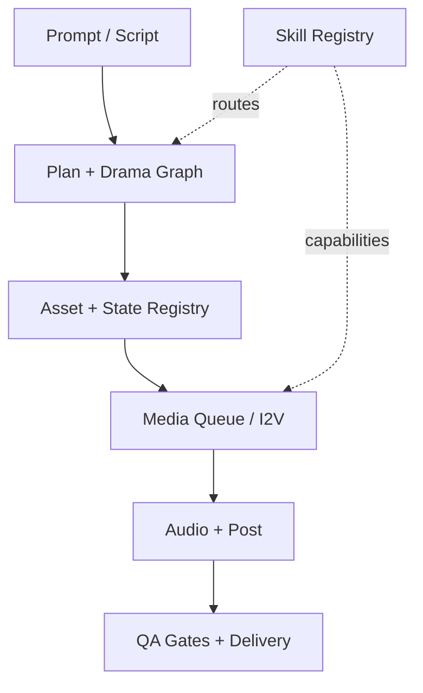

# Project Graph

> This file is generated by `scripts/sync_project_docs.py`. Edit the source files, then run `make sync-docs`.

- Plugin: `ai-film-grok` v`1.19.0`
- Source of truth: `plugin.json`, `skills/ai-film-grok/registry/skills.json`, `scripts/`, and `tests/`.
- Local `.codegraph` is an ignored machine cache and is intentionally not published.

## Registry by phase

| Phase | Registered skills |
|---|---|
| Phase 0 | character.bible.build, continuity.check, director.control, dispatch.orchestrate, export.package, image.animate, keyframe.generate, music.plan, quality.inspect, shot.plan, sound.design, subtitle.generate, timeline.compose, video.render, voice.synthesize |
| Phase 1 | beat.extract, department.manage, director.control, panel.layout, scene.segment |
| Phase 2 | department.manage, director.control, dispatch.orchestrate |
| Phase 3 | beat.extract, beat.validate, department.manage, director.control, episode.structure, graph.project, heat.lint, heat.vo-suggest, projection.verify, scene.segment, shot.plan, story.normalize, story.validate |
| Phase 4 | character.bible.build, character.state.update, continuity.check, department.manage, director.control, location.bible.build, prop.track |
| Phase 5 | department.manage, director.control, heat.lint, keyframe.generate, panel.layout |
| Phase 6 | camera.motion.plan, department.manage, director.control, image.animate |
| Phase 7 | department.manage, director.control, music.plan, sound.design, subtitle.generate, voice.synthesize |
| Phase 8 | rhythm.evaluate, timeline.compose |
| Phase 9 | export.package, quality.inspect, video.render |

## Repository surfaces

| Surface | Role |
|---|---|
| `skills/ai-film-grok/scripts/aifilm` | CLI launcher |
| `skills/ai-film-grok/registry/skills.json` | Capability and routing registry |
| `skills/ai-film-grok/tests/` | Automated gates |
| `README.md` | User and maintainer installation |
| `.github/workflows/ci.yml` | CI validation |

## Test inventory

- `test_act_structure_pace_chart.py`
- `test_adapter_smoke.py`
- `test_adult_heat_upgrade.py`
- `test_advanced_audio_optimizations.py`
- `test_approval_ledger.py`
- `test_asset_registry.py`
- `test_audio_bible.py`
- `test_audio_provenance.py`
- `test_audio_recipe.py`
- `test_auto_cut.py`
- `test_axis_jump_gate.py`
- `test_capability.py`
- `test_caption_frame_audit.py`
- `test_cast_hair_makeup_locks.py`
- `test_character_bible.py`
- `test_character_state_continuity.py`
- `test_cinema_prompt.py`
- `test_cinematic_color_grading.py`
- `test_cli_plan_mutation.py`
- `test_cli_plan_project.py`
- `test_cli_plan_run.py`
- `test_cli_smoke.py`
- `test_compose_preview.py`
- `test_compose_render.py`
- `test_content_channels.py`
- `test_continuity_chain.py`
- `test_craft_spine.py`
- `test_cut_silk_bilingual.py`
- `test_dailies_selects.py`
- `test_delivery_gates.py`
- `test_department_cli.py`
- `test_department_contracts.py`
- `test_department_quality_reports.py`
- `test_dialogue_contract.py`
- `test_director_coverage_and_review.py`
- `test_director_intent.py`
- `test_director_ledger.py`
- `test_director_migration.py`
- `test_director_stage_gates.py`
- `test_directors_lens_docs.py`
- `test_dispatch.py`
- `test_dispatch_actions.py`
- `test_doctor_readiness.py`
- `test_drama_graph.py`
- `test_edit_policy.py`
- `test_edit_strategy.py`
- `test_evidence_status.py`
- `test_execution_graph.py`
- `test_export_composition.py`
- `test_external_backends.py`
- `test_final_preflight.py`
- `test_frame_chain.py`
- `test_frame_promote.py`
- `test_framing_lint.py`
- `test_frw_degrade_docs.py`
- `test_gaze_tracking.py`
- `test_genre_beat_spines.py`
- `test_grok_oauth_pack.py`
- `test_heat_arc_multi.py`
- `test_i2v_profile.py`
- `test_i2v_provider.py`
- `test_intake.py`
- `test_intake_review.py`
- `test_jcut_lcut_editing.py`
- `test_launchers.py`
- `test_lock_style_samefile.py`
- `test_loudnorm_policy.py`
- `test_master_delivery.py`
- `test_meaningful_motion.py`
- `test_media_duration.py`
- `test_media_qa.py`
- `test_media_queue.py`
- `test_micro_motion.py`
- `test_motion_plan.py`
- `test_music_template.py`
- `test_narrative_control.py`
- `test_narrative_hooks.py`
- `test_native_audio_mix.py`
- `test_neural_motion_qa.py`
- `test_next_actions.py`
- `test_opt2_edge_queue_framing.py`
- `test_p2_director_control.py`
- `test_performance_director_board.py`
- `test_performance_timeline.py`
- `test_phase_f_audio_status.py`
- `test_phoneme_alignment.py`
- `test_picture_lock.py`
- `test_pilot_review.py`
- `test_pipeline_validation.py`
- `test_plan_from_intake.py`
- `test_planning_autopilot.py`
- `test_plot_adaptive_bgm.py`
- `test_pose_and_size_rotation.py`
- `test_post_audit.py`
- `test_post_bible.py`
- `test_predictive_media_queue.py`
- `test_preflight.py`
- `test_production_book.py`
- `test_production_evidence.py`
- `test_production_gates.py`
- `test_professional_golden.py`
- `test_prompt_budget.py`
- `test_prompt_compression_pilot.py`
- `test_prompt_injector.py`
- `test_quality_gates.py`
- `test_queue_requeue.py`
- `test_resume_idempotency.py`
- `test_rhythm.py`
- `test_runtime_policy.py`
- `test_safe_sidecars.py`
- `test_security_policy.py`
- `test_seedance_bridge.py`
- `test_sfx_accent.py`
- `test_shot_inventory.py`
- `test_shot_package.py`
- `test_shot_review.py`
- `test_sidechain_and_tts_gate.py`
- `test_skill_registry.py`
- `test_skill_runner.py`
- `test_smooth_flow.py`
- `test_sound_plan_mood.py`
- `test_source_chain.py`
- `test_spatial_audio_foley.py`
- `test_speaker_coded_subtitles.py`
- `test_speech_performance_timing.py`
- `test_stale_propagation.py`
- `test_story_plan.py`
- `test_subtitle_cut_boundaries.py`
- `test_subtitle_dialogue_alignment.py`
- `test_take_registry.py`
- `test_temporal_denoising_cas.py`
- `test_title_double_burn_docs.py`
- `test_title_end_procedural.py`
- `test_tts_ab.py`
- `test_tts_rehearsal.py`
- `test_user_source_fidelity.py`
- `test_util.py`
- `test_visual_bible.py`
- `test_vo_atempo.py`
- `test_vo_budget.py`
- `test_vo_motion_link.py`
- `test_voice_tracks.py`

## Update contract

1. Change source code or registry.
2. Run `make sync-docs`.
3. Run `make release-check`.
4. Run `make sync` to commit, push, and verify local/remote SHA equality.
