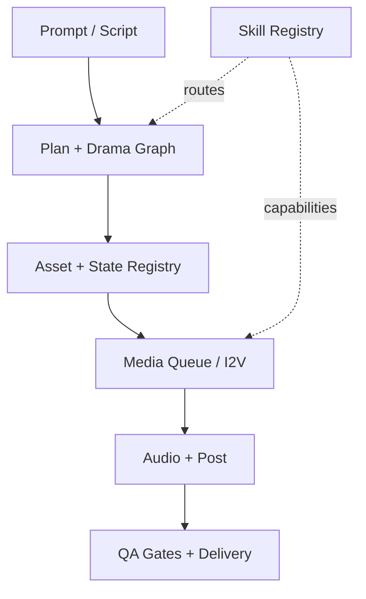

# Project Graph

> This file is generated by `scripts/sync_project_docs.py`. Edit the source files, then run `make sync-docs`.

- Plugin: `ai-film-grok` v`2.25.0`
- Shipped skills: `ai-film-grok`, `ai-film-project`.
- Source of truth: `plugin.json`, shipped `skills/*/`, registry, scripts, and tests.
- Local `.codegraph` is an ignored machine cache and is intentionally not published.

## Registry by phase

| Phase | Registered skills |
|---|---|
| Phase 0 | character.bible.build, continuity.check, director.control, dispatch.orchestrate, export.package, image.animate, keyframe.generate, music.plan, quality.inspect, shot.plan, sound.design, subtitle.generate, timeline.compose, video.render, voice.synthesize |
| Phase 1 | beat.extract, department.manage, director.control, panel.layout, scene.segment, story.receive |
| Phase 2 | department.manage, director.control, dispatch.orchestrate |
| Phase 3 | beat.extract, beat.validate, department.manage, director.control, episode.structure, graph.project, heat.lint, heat.vo-suggest, projection.verify, scene.segment, shot.plan, story.normalize, story.receive, story.validate |
| Phase 4 | character.bible.build, character.state.update, continuity.check, department.manage, director.control, location.bible.build, prop.track |
| Phase 5 | department.manage, director.control, heat.lint, keyframe.generate, panel.layout |
| Phase 6 | camera.motion.plan, department.manage, director.control, image.animate |
| Phase 7 | audio.asr-review, department.manage, director.control, music.plan, sound.design, subtitle.generate, voice.synthesize |
| Phase 8 | rhythm.evaluate, timeline.compose |
| Phase 9 | export.package, quality.inspect, video.render |

## Repository surfaces

| Surface | Role |
|---|---|
| `skills/ai-film-grok/scripts/aifilm` | CLI launcher |
| `skills/ai-film-grok/registry/skills.json` | Capability and routing registry |
| `skills/ai-film-grok/tests/` | Automated gates |
| `skills/ai-film-project/` | Project blueprint skill and validator |
| `tests/` | Plugin-level contract tests |
| `README.md` | User and maintainer installation |
| `.github/workflows/ci.yml` | CI validation |

## Test inventory

- `skills/ai-film-grok/tests/test_ace_step_music_adapter.py`
- `skills/ai-film-grok/tests/test_acoustic_policy.py`
- `skills/ai-film-grok/tests/test_act_structure_pace_chart.py`
- `skills/ai-film-grok/tests/test_act_structure_verify.py`
- `skills/ai-film-grok/tests/test_adapter_smoke.py`
- `skills/ai-film-grok/tests/test_adult_female_voice_pack.py`
- `skills/ai-film-grok/tests/test_adult_heat_upgrade.py`
- `skills/ai-film-grok/tests/test_adult_max_director.py`
- `skills/ai-film-grok/tests/test_adult_max_iron.py`
- `skills/ai-film-grok/tests/test_adult_max_wave2.py`
- `skills/ai-film-grok/tests/test_adult_max_wave3.py`
- `skills/ai-film-grok/tests/test_adult_max_wave4.py`
- `skills/ai-film-grok/tests/test_adult_max_wave5.py`
- `skills/ai-film-grok/tests/test_adult_max_wave6.py`
- `skills/ai-film-grok/tests/test_advance.py`
- `skills/ai-film-grok/tests/test_advanced_audio_optimizations.py`
- `skills/ai-film-grok/tests/test_ambience_candidates.py`
- `skills/ai-film-grok/tests/test_anatomy_safety.py`
- `skills/ai-film-grok/tests/test_approval_ledger.py`
- `skills/ai-film-grok/tests/test_asset_registry.py`
- `skills/ai-film-grok/tests/test_audio_armory.py`
- `skills/ai-film-grok/tests/test_audio_bible.py`
- `skills/ai-film-grok/tests/test_audio_cues.py`
- `skills/ai-film-grok/tests/test_audio_delivery_gate.py`
- `skills/ai-film-grok/tests/test_audio_event_editor.py`
- `skills/ai-film-grok/tests/test_audio_node_client.py`
- `skills/ai-film-grok/tests/test_audio_node_service.py`
- `skills/ai-film-grok/tests/test_audio_plan.py`
- `skills/ai-film-grok/tests/test_audio_provenance.py`
- `skills/ai-film-grok/tests/test_audio_recipe.py`
- `skills/ai-film-grok/tests/test_audio_timeline.py`
- `skills/ai-film-grok/tests/test_audio_tts_manifest.py`
- `skills/ai-film-grok/tests/test_audio_tts_render.py`
- `skills/ai-film-grok/tests/test_audio_visual_alignment.py`
- `skills/ai-film-grok/tests/test_audit_lessons.py`
- `skills/ai-film-grok/tests/test_auto_cut.py`
- `skills/ai-film-grok/tests/test_automation_verify.py`
- `skills/ai-film-grok/tests/test_axis_jump_gate.py`
- `skills/ai-film-grok/tests/test_benchmark.py`
- `skills/ai-film-grok/tests/test_bgm_candidates.py`
- `skills/ai-film-grok/tests/test_bgm_final_integration.py`
- `skills/ai-film-grok/tests/test_bgm_library.py`
- `skills/ai-film-grok/tests/test_burn_srt_pil.py`
- `skills/ai-film-grok/tests/test_cache.py`
- `skills/ai-film-grok/tests/test_capability.py`
- `skills/ai-film-grok/tests/test_caption_frame_audit.py`
- `skills/ai-film-grok/tests/test_cast_hair_makeup_locks.py`
- `skills/ai-film-grok/tests/test_character_bible.py`
- `skills/ai-film-grok/tests/test_character_state_continuity.py`
- `skills/ai-film-grok/tests/test_checkpoint.py`
- `skills/ai-film-grok/tests/test_ci_roi_contract.py`
- `skills/ai-film-grok/tests/test_cinema_prompt.py`
- `skills/ai-film-grok/tests/test_cinematic_color_grading.py`
- `skills/ai-film-grok/tests/test_cli_bgm_library.py`
- `skills/ai-film-grok/tests/test_cli_motion.py`
- `skills/ai-film-grok/tests/test_cli_node.py`
- `skills/ai-film-grok/tests/test_cli_plan_mutation.py`
- `skills/ai-film-grok/tests/test_cli_plan_project.py`
- `skills/ai-film-grok/tests/test_cli_plan_run.py`
- `skills/ai-film-grok/tests/test_cli_roundtrip.py`
- `skills/ai-film-grok/tests/test_cli_smoke.py`
- `skills/ai-film-grok/tests/test_cli_weapon.py`
- `skills/ai-film-grok/tests/test_clip_uniqueness.py`
- `skills/ai-film-grok/tests/test_closed_loop.py`
- `skills/ai-film-grok/tests/test_color_grade.py`
- `skills/ai-film-grok/tests/test_color_grading.py`
- `skills/ai-film-grok/tests/test_comfy_armory.py`
- `skills/ai-film-grok/tests/test_comfy_broker_service.py`
- `skills/ai-film-grok/tests/test_comfy_recovery.py`
- `skills/ai-film-grok/tests/test_comfy_video.py`
- `skills/ai-film-grok/tests/test_compose_preview.py`
- `skills/ai-film-grok/tests/test_compose_render.py`
- `skills/ai-film-grok/tests/test_composition_rules.py`
- `skills/ai-film-grok/tests/test_content_channels.py`
- `skills/ai-film-grok/tests/test_continuity_chain.py`
- `skills/ai-film-grok/tests/test_cosyvoice_local_tts.py`
- `skills/ai-film-grok/tests/test_craft_spine.py`
- `skills/ai-film-grok/tests/test_creative_quality.py`
- `skills/ai-film-grok/tests/test_creative_workshop.py`
- `skills/ai-film-grok/tests/test_cut_silk_bilingual.py`
- `skills/ai-film-grok/tests/test_dailies_selects.py`
- `skills/ai-film-grok/tests/test_dailies_workflow.py`
- `skills/ai-film-grok/tests/test_delivery_artifact.py`
- `skills/ai-film-grok/tests/test_delivery_gates.py`
- `skills/ai-film-grok/tests/test_delivery_package.py`
- `skills/ai-film-grok/tests/test_department_cli.py`
- `skills/ai-film-grok/tests/test_department_contracts.py`
- `skills/ai-film-grok/tests/test_department_quality_reports.py`
- `skills/ai-film-grok/tests/test_dialogue_broll.py`
- `skills/ai-film-grok/tests/test_dialogue_competition.py`
- `skills/ai-film-grok/tests/test_dialogue_contract.py`
- `skills/ai-film-grok/tests/test_dialogue_i2i_route.py`
- `skills/ai-film-grok/tests/test_dialogue_ledger.py`
- `skills/ai-film-grok/tests/test_dialogue_screenplay.py`
- `skills/ai-film-grok/tests/test_dialogue_workflow_hardening.py`
- `skills/ai-film-grok/tests/test_director_coverage_and_review.py`
- `skills/ai-film-grok/tests/test_director_intent.py`
- `skills/ai-film-grok/tests/test_director_ledger.py`
- `skills/ai-film-grok/tests/test_director_migrate_audit.py`
- `skills/ai-film-grok/tests/test_director_migration.py`
- `skills/ai-film-grok/tests/test_director_stage_gates.py`
- `skills/ai-film-grok/tests/test_director_verify.py`
- `skills/ai-film-grok/tests/test_directors_lens_docs.py`
- `skills/ai-film-grok/tests/test_dispatch.py`
- `skills/ai-film-grok/tests/test_dispatch_actions.py`
- `skills/ai-film-grok/tests/test_dispatch_compact.py`
- `skills/ai-film-grok/tests/test_doctor_readiness.py`
- `skills/ai-film-grok/tests/test_drama_graph.py`
- `skills/ai-film-grok/tests/test_duration_advisory.py`
- `skills/ai-film-grok/tests/test_edit_edl_merge.py`
- `skills/ai-film-grok/tests/test_edit_policy.py`
- `skills/ai-film-grok/tests/test_edit_strategy.py`
- `skills/ai-film-grok/tests/test_elevenlabs_canary.py`
- `skills/ai-film-grok/tests/test_event_subtitles.py`
- `skills/ai-film-grok/tests/test_event_voice_stem.py`
- `skills/ai-film-grok/tests/test_evidence_status.py`
- `skills/ai-film-grok/tests/test_execution_graph.py`
- `skills/ai-film-grok/tests/test_export_composition.py`
- `skills/ai-film-grok/tests/test_external_backends.py`
- `skills/ai-film-grok/tests/test_external_review.py`
- `skills/ai-film-grok/tests/test_face_identity.py`
- `skills/ai-film-grok/tests/test_final_preflight.py`
- `skills/ai-film-grok/tests/test_final_review_input.py`
- `skills/ai-film-grok/tests/test_final_stages.py`
- `skills/ai-film-grok/tests/test_frame_chain.py`
- `skills/ai-film-grok/tests/test_frame_promote.py`
- `skills/ai-film-grok/tests/test_framing_lint.py`
- `skills/ai-film-grok/tests/test_frw_degrade_docs.py`
- `skills/ai-film-grok/tests/test_frw_dispatch.py`
- `skills/ai-film-grok/tests/test_frw_lipsync.py`
- `skills/ai-film-grok/tests/test_frw_subprocess_contract.py`
- `skills/ai-film-grok/tests/test_frw_upload.py`
- `skills/ai-film-grok/tests/test_gaze_tracking.py`
- `skills/ai-film-grok/tests/test_generation_usage.py`
- `skills/ai-film-grok/tests/test_genre_beat_spines.py`
- `skills/ai-film-grok/tests/test_grok_oauth_pack.py`
- `skills/ai-film-grok/tests/test_grok_reference_video_adapter.py`
- `skills/ai-film-grok/tests/test_hard_defaults.py`
- `skills/ai-film-grok/tests/test_hardcore_extreme.py`
- `skills/ai-film-grok/tests/test_heat_arc_multi.py`
- `skills/ai-film-grok/tests/test_heat_check.py`
- `skills/ai-film-grok/tests/test_higgs_performance_adapter.py`
- `skills/ai-film-grok/tests/test_i2v_motion_gate.py`
- `skills/ai-film-grok/tests/test_i2v_profile.py`
- `skills/ai-film-grok/tests/test_i2v_provider.py`
- `skills/ai-film-grok/tests/test_intake.py`
- `skills/ai-film-grok/tests/test_intake_review.py`
- `skills/ai-film-grok/tests/test_jcut_lcut_editing.py`
- `skills/ai-film-grok/tests/test_launchers.py`
- `skills/ai-film-grok/tests/test_lipsync_canary.py`
- `skills/ai-film-grok/tests/test_lipsync_challenge.py`
- `skills/ai-film-grok/tests/test_lipsync_node_client.py`
- `skills/ai-film-grok/tests/test_lipsync_node_routing.py`
- `skills/ai-film-grok/tests/test_lipsync_node_service.py`
- `skills/ai-film-grok/tests/test_lipsync_pilot.py`
- `skills/ai-film-grok/tests/test_local_llm.py`
- `skills/ai-film-grok/tests/test_lock_style_samefile.py`
- `skills/ai-film-grok/tests/test_logger.py`
- `skills/ai-film-grok/tests/test_loudnorm_policy.py`
- `skills/ai-film-grok/tests/test_lufs_and_face_hash.py`
- `skills/ai-film-grok/tests/test_manifest_truth.py`
- `skills/ai-film-grok/tests/test_master_delivery.py`
- `skills/ai-film-grok/tests/test_meaningful_motion.py`
- `skills/ai-film-grok/tests/test_media_duration.py`
- `skills/ai-film-grok/tests/test_media_duration_cache.py`
- `skills/ai-film-grok/tests/test_media_probe.py`
- `skills/ai-film-grok/tests/test_media_qa.py`
- `skills/ai-film-grok/tests/test_media_queue.py`
- `skills/ai-film-grok/tests/test_merge_edls.py`
- `skills/ai-film-grok/tests/test_micro_motion.py`
- `skills/ai-film-grok/tests/test_mmaudio_adapter.py`
- `skills/ai-film-grok/tests/test_motion_evidence_gates.py`
- `skills/ai-film-grok/tests/test_motion_plan.py`
- `skills/ai-film-grok/tests/test_music_cue.py`
- `skills/ai-film-grok/tests/test_music_editor.py`
- `skills/ai-film-grok/tests/test_music_spotting_verify.py`
- `skills/ai-film-grok/tests/test_music_template.py`
- `skills/ai-film-grok/tests/test_narrative_control.py`
- `skills/ai-film-grok/tests/test_narrative_hooks.py`
- `skills/ai-film-grok/tests/test_native_audio_mix.py`
- `skills/ai-film-grok/tests/test_neural_motion_qa.py`
- `skills/ai-film-grok/tests/test_next_actions.py`
- `skills/ai-film-grok/tests/test_opt2_edge_queue_framing.py`
- `skills/ai-film-grok/tests/test_optimization_system.py`
- `skills/ai-film-grok/tests/test_p2_director_control.py`
- `skills/ai-film-grok/tests/test_p4_fulfillment_gates.py`
- `skills/ai-film-grok/tests/test_pace_chart_verify.py`
- `skills/ai-film-grok/tests/test_performance_candidates.py`
- `skills/ai-film-grok/tests/test_performance_cue.py`
- `skills/ai-film-grok/tests/test_performance_director_board.py`
- `skills/ai-film-grok/tests/test_performance_state.py`
- `skills/ai-film-grok/tests/test_performance_timeline.py`
- `skills/ai-film-grok/tests/test_phase_f_audio_status.py`
- `skills/ai-film-grok/tests/test_phoneme_alignment.py`
- `skills/ai-film-grok/tests/test_picture_lock.py`
- `skills/ai-film-grok/tests/test_pilot_review.py`
- `skills/ai-film-grok/tests/test_pipeline_validation.py`
- `skills/ai-film-grok/tests/test_plan_from_intake.py`
- `skills/ai-film-grok/tests/test_planning_autopilot.py`
- `skills/ai-film-grok/tests/test_platform_package.py`
- `skills/ai-film-grok/tests/test_plot_adaptive_bgm.py`
- `skills/ai-film-grok/tests/test_pose_and_size_rotation.py`
- `skills/ai-film-grok/tests/test_post_audit.py`
- `skills/ai-film-grok/tests/test_post_bible.py`
- `skills/ai-film-grok/tests/test_post_plan.py`
- `skills/ai-film-grok/tests/test_post_quality.py`
- `skills/ai-film-grok/tests/test_predictive_media_queue.py`
- `skills/ai-film-grok/tests/test_preflight.py`
- `skills/ai-film-grok/tests/test_production_book.py`
- `skills/ai-film-grok/tests/test_production_consistency.py`
- `skills/ai-film-grok/tests/test_production_evidence.py`
- `skills/ai-film-grok/tests/test_production_gates.py`
- `skills/ai-film-grok/tests/test_production_report.py`
- `skills/ai-film-grok/tests/test_production_router.py`
- `skills/ai-film-grok/tests/test_production_team.py`
- `skills/ai-film-grok/tests/test_professional_director_e2e.py`
- `skills/ai-film-grok/tests/test_professional_golden.py`
- `skills/ai-film-grok/tests/test_project_audit.py`
- `skills/ai-film-grok/tests/test_promotion_report.py`
- `skills/ai-film-grok/tests/test_prompt_budget.py`
- `skills/ai-film-grok/tests/test_prompt_compression_pilot.py`
- `skills/ai-film-grok/tests/test_prompt_injector.py`
- `skills/ai-film-grok/tests/test_provider_canary.py`
- `skills/ai-film-grok/tests/test_quality_closure.py`
- `skills/ai-film-grok/tests/test_quality_evidence.py`
- `skills/ai-film-grok/tests/test_quality_gates.py`
- `skills/ai-film-grok/tests/test_quality_ledger.py`
- `skills/ai-film-grok/tests/test_queue_requeue.py`
- `skills/ai-film-grok/tests/test_queue_usage_binding.py`
- `skills/ai-film-grok/tests/test_render_core_helpers.py`
- `skills/ai-film-grok/tests/test_render_workspace.py`
- `skills/ai-film-grok/tests/test_resume_idempotency.py`
- `skills/ai-film-grok/tests/test_review_control.py`
- `skills/ai-film-grok/tests/test_review_ui.py`
- `skills/ai-film-grok/tests/test_rhythm.py`
- `skills/ai-film-grok/tests/test_runtime_policy.py`
- `skills/ai-film-grok/tests/test_safe_sidecars.py`
- `skills/ai-film-grok/tests/test_scene_art_direction.py`
- `skills/ai-film-grok/tests/test_scene_sound.py`
- `skills/ai-film-grok/tests/test_scene_sound_stems.py`
- `skills/ai-film-grok/tests/test_security_policy.py`
- `skills/ai-film-grok/tests/test_seedance_bridge.py`
- `skills/ai-film-grok/tests/test_semantic_index.py`
- `skills/ai-film-grok/tests/test_serial_quality.py`
- `skills/ai-film-grok/tests/test_sfx_accent.py`
- `skills/ai-film-grok/tests/test_sfx_candidates.py`
- `skills/ai-film-grok/tests/test_shot_inventory.py`
- `skills/ai-film-grok/tests/test_shot_package.py`
- `skills/ai-film-grok/tests/test_shot_review.py`
- `skills/ai-film-grok/tests/test_sidechain_and_tts_gate.py`
- `skills/ai-film-grok/tests/test_skill_registry.py`
- `skills/ai-film-grok/tests/test_skill_runner.py`
- `skills/ai-film-grok/tests/test_smooth_flow.py`
- `skills/ai-film-grok/tests/test_sound_and_review.py`
- `skills/ai-film-grok/tests/test_sound_plan_mood.py`
- `skills/ai-film-grok/tests/test_source_chain.py`
- `skills/ai-film-grok/tests/test_spatial_audio_foley.py`
- `skills/ai-film-grok/tests/test_speaker_coded_subtitles.py`
- `skills/ai-film-grok/tests/test_speech_performance_timing.py`
- `skills/ai-film-grok/tests/test_stable_audio_adapter.py`
- `skills/ai-film-grok/tests/test_stale_propagation.py`
- `skills/ai-film-grok/tests/test_still_uniqueness.py`
- `skills/ai-film-grok/tests/test_story_plan.py`
- `skills/ai-film-grok/tests/test_story_reception.py`
- `skills/ai-film-grok/tests/test_strict_gate_paths.py`
- `skills/ai-film-grok/tests/test_style_lock.py`
- `skills/ai-film-grok/tests/test_subtitle_cut_boundaries.py`
- `skills/ai-film-grok/tests/test_subtitle_dialogue_alignment.py`
- `skills/ai-film-grok/tests/test_sync_project_docs.py`
- `skills/ai-film-grok/tests/test_take_registry.py`
- `skills/ai-film-grok/tests/test_temporal_denoising_cas.py`
- `skills/ai-film-grok/tests/test_title_double_burn_docs.py`
- `skills/ai-film-grok/tests/test_title_end_procedural.py`
- `skills/ai-film-grok/tests/test_transition_frame_audit.py`
- `skills/ai-film-grok/tests/test_tts_ab.py`
- `skills/ai-film-grok/tests/test_tts_audio_node_probe.py`
- `skills/ai-film-grok/tests/test_tts_event_contract.py`
- `skills/ai-film-grok/tests/test_tts_rehearsal.py`
- `skills/ai-film-grok/tests/test_uploaded_style_reference_gate.py`
- `skills/ai-film-grok/tests/test_user_source_fidelity.py`
- `skills/ai-film-grok/tests/test_util.py`
- `skills/ai-film-grok/tests/test_v123_extracted_capabilities.py`
- `skills/ai-film-grok/tests/test_vibevoice_asr_review.py`
- `skills/ai-film-grok/tests/test_vibevoice_asr_ssh.py`
- `skills/ai-film-grok/tests/test_visual_bible.py`
- `skills/ai-film-grok/tests/test_vo_atempo.py`
- `skills/ai-film-grok/tests/test_vo_budget.py`
- `skills/ai-film-grok/tests/test_vo_motion_link.py`
- `skills/ai-film-grok/tests/test_voice_armory.py`
- `skills/ai-film-grok/tests/test_voice_lang_and_srt_clamp.py`
- `skills/ai-film-grok/tests/test_voice_tracks.py`
- `skills/ai-film-grok/tests/test_wardrobe_ladder.py`
- `skills/ai-film-grok/tests/test_weapon_router.py`
- `skills/ai-film-grok/tests/test_workflow_spine.py`
- `skills/ai-film-project/tests/test_validate_project_blueprint.py`
- `tests/test_premium_pipeline_contracts.py`
- `tests/test_release_gate.py`

## Update contract

1. Change source code or registry.
2. Run `make sync-docs`.
3. Run `make release-check`.
4. Run `make sync` to commit, push, and verify local/remote SHA equality.
