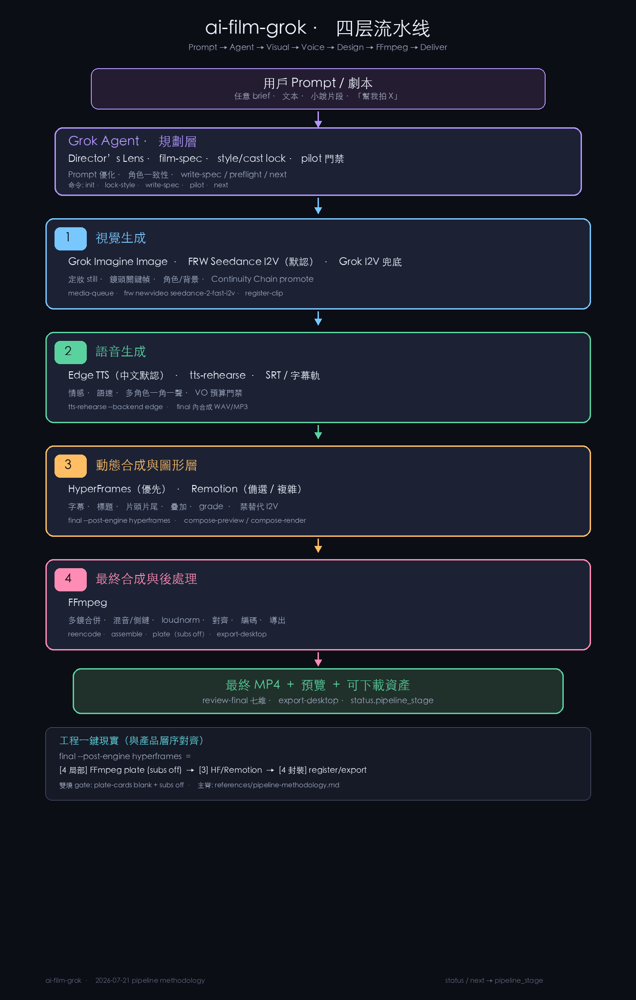

# ai-film-grok（skill 本体）

> **安装 / 使用逻辑 / 架构图 / 可插拔模型** → 仓库根 [README.md](../../README.md)（对外主文档）。

**一句话**：把「从灵感到可发布的 AI 动态短片」收成**可恢复、可验收**的七段流程——定义故事 → 设计演出 → Pilot → 批量制作 → 选片与粗剪 → 后期母版 → 审片与交付。

正式交付必须是**真实动态成片**（I2V 验收），不是静图轮播、Ken Burns 或只有关键帧。

### 四层方法论（主脊）

```text
用户 Prompt / 剧本
        ↓
Grok Agent（规划 + Prompt 优化 + 角色一致性 + dispatch）
        ↓
1. 视觉生成     Grok Imagine 静帧 + I2V（默认 grok_primary：对白讲话镜锁 FRW LTX 原生有声 → Grok 主链）
2. 语音生成     Edge TTS（可插拔 voicebox / grok / minimax / fish / external）
3. 动态合成     HyperFrames（优先） / Remotion（备选）
4. 最终后处理   FFmpeg（拼板 · 混音 · 导出）
        ↓
最终 MP4 + 预览 + 可下载资产
```

**Skill 入口**：[`SKILL.md`](SKILL.md) 主脊 + 阶段路由 + 命令  
- **电影工序**：[`references/generative-film-craft.md`](references/generative-film-craft.md)  
- **工具四层**：[`references/pipeline-methodology.md`](references/pipeline-methodology.md)  
- 弹性默认：[`references/hard-defaults.md`](references/hard-defaults.md)

运行时：优先 `aifilm dispatch` 的 **`phase`**；`status|next|preflight|stage` 的 `pipeline_stage` 仅供 HUD／旧项目诊断。

### 架构总览



> 当前季默认 **I2V = grok_primary**；`ltx23_primary` 仅保留给已锁定的旧项目。完整插拔矩阵与安装步骤见仓库根 README。

---

## 这个 skill 能帮你省多少功？

手工用聊天窗口「一张张出图 → 一张张转视频 → 自己剪 → 自己配音 → 自己对字幕」，做一条 **60 秒竖屏（约 10 镜）** 时，常见成本大致是：

| 工作块 | 手工常见耗时 / 痛点 | 用本 skill 后 |
|--------|---------------------|---------------|
| 角色/画风定妆 | 反复改 prompt，脸服每镜飘 | **双 master**（style-v1 + cast-v1）+ lookbook，全片同一锚 |
| 分镜与旁白节奏 | 旁白过长 → 画面 loop 重播、成片无聊 | **Director’s Lens**（文本→故事→storyboard）+ **film-spec + VO 预算门禁** |
| 批量出图出片 | 记不住哪镜过了、重跑撞墙 | **media-queue** 串行 claim、失败 typed requeue、断点可续 |
| 一致性验收 | 成片才发现换脸/换服/换模 | **全项目硬性 cinematic-audit**（节拍、表演、对白覆盖、构图、连续性）+ pilot 三镜门禁 + still/clip 注册 + 十六维 scorecard；旧项目同样必须重审与补拍 |
| 配音混音字幕 | 手搓 TTS、BGM 抢戏、无字幕 | **一键 `final`**：Edge/外部 TTS、R&B 床轨、旁白 duck、PIL 烧字幕 |
| 60 秒时长对齐 | 短旁白把成片压成 40 秒 | **`duration_sec` 槽位下限**（静音 pad + 画面 hold 满槽） |
| 色气片踩坑 | BGM 变恐怖、中文声线乱、审核连撞 | 默认 **rnb**、中文 **edge**、moderation 换 soft still 纪律 |
| 系列续作 | 每集重定妆 | **复用 cast master**，新 root + 新剧情即可 |

### 粗算（一条 10 镜 · 60s 竖屏）

| 角色 | 手工（无纪律） | 本 skill + Grok Build agent |
|------|----------------|-----------------------------|
| 制片/导演决策 | 2–4 h（结构、节奏、重拍标准模糊） | **~15–40 min**（Director’s Lens 重构 + intent + film-spec，门禁自动拦错） |
| 出图 / 出动态 | 3–8 h（重做、漂移、记不住版本） | **~1–2.5 h**（定妆 + pilot + 串行 I2V；墙钟主要等 Imagine） |
| 后期成片 | 1–3 h（剪、配、字幕、对齐） | **`final` 数分钟级**（含 TTS + BGM + 烧字幕） |
| 质检返工 | 难估（常到交付前才爆） | **preflight / motion QA / pilot / review-final** 前置拦截 |

> **合计体感**：从「折腾一整天还漂」压到 **半日～一工作日内可交付技术成片**（含等待 Grok Imagine 队列）。  
> 省下的不只是时间，更是 **重拍次数、loop 废片、画风漂移导致的整片作废**。

**你仍要做的**（skill 故意不替你跳过）：

1. 给参考角色 / 定妆审美；  
2. 批准 pilot 三镜（说「可以」等）；  
3. 完整看完成片，十六维 scorecard 签字。

---

## 技术栈（你实际在用什么）

### 核心生成：FRW LTX primary + 证据化 fallback

| 能力 | 在本 skill 中的角色 | 入口 |
|------|---------------------|------|
| **Grok Imagine（图像）** | 文生图 / 图生图：风格样张、定妆、每镜关键帧 | `image_gen`、`image_edit` |
| **Grok Imagine Video** | 当前 `grok_primary` 第一动作路线（对白讲话镜锁 FRW LTX 有声）；需影片级 approved canary | `image_to_video` |
| **FRW LTX 2.3** | 对白讲话镜原生有声主链；否则分类技术失败后的备选路线；需影片级 approved canary | `"$AIFILM" frw img2video-audio --model ltx2.3` |
| **FRW API I2V** | 无对白动作在 Grok 不可用后的备选路线；需影片级 approved canary | `"$AIFILM" frw img2video` |

要点：

- **分层**：静帧默认 **Grok**；bulk 动画主链为 **Grok → FRW API I2V → FRW LTX**（对白讲话镜直接锁 FRW LTX 原生有声），每次切换都须分类技术失败并写 provider-switch receipt。
- FRW fallback 必须区分 `FRW_API_KEY`（任务 API）与 `FRW_TOKEN`（上传 JWT）；上传前执行 `upload-probe`。
- **禁止** 默认 legacy `img2video`；**禁止** 576 生成再放大到 720 当高清。  
- Python **不内嵌 key**：Grok 工具由 agent 调；FRW 经 `frw_dispatch` + frwclaw `.env`；本仓库负责 **规格、队列、QA、成片门禁**。  
- **单镜头 provider 原则**：同一 shot 一旦切到 FRW fallback，后续重试固定 FRW；不得把切换隐藏在 manifest 中。
### 本地控制台与成片

高质量竖屏项目可显式启用 authored creative gates：

```bash
aifilm director init --root <film-root> --quality-target premium_vertical
aifilm director status --root <film-root>
aifilm preflight --root <film-root>
```

Premium 项目在真实 Pilot 前可先建立无花费的质量闭环；它不会调用 provider 或花费额度：

```bash
aifilm quality-closure package --root <film-root>
aifilm quality-closure report --root <film-root>
```

只有真实 provider 媒体、当前成片交付证据和两位独立盲审齐全，报告才会标示艺术品质已验证；provider canary 还必须匹配已注册、approved、active 的 manifest clip。细则见 [`references/quality-closure.md`](references/quality-closure.md)。

旧项目默认 `standard`，不会被静默升级。

| 组件 | 用途 |
|------|------|
| **`aifilm` CLI** | init / lock-style / write-spec / register / final / review / export / next / preflight / doctor |
| **`media-queue`** | 本地 I2V 任务队列：add → claim → complete/fail → requeue；串行防 429 |
| **film-spec JSON + schema** | 导演意图、分镜 beat、旁白、运镜 DSL、转场与 sound_plan |
| **style-bible** | medium / palette / signature_block / identity_lock / cast_masters / 上传画风图 SHA-256 锚 |
| **FFmpeg + PIL** | 拼接、xfade、stretch/hold、VO 混音、BGM duck、字幕烧录 |
| **Edge TTS（默认中文）** | 说书 `write-spec` 钉 edge；支持 shot-level `performance_cue`；禁止 Neural 名塞 ElevenLabs |
| **表达式 TTS（显式）** | `qwen3` 本机 voice design/clone；`higgs` 可信 adapter；未就绪不静默替换 |
| **程序化 R&B + 听感** | rnb / auto_sfx / sidechain / loudnorm auto；本地 `audio/bgm.wav` 模板曲 |
| **HyperFrames / Remotion**（层 3 · 交付推荐） | 标题/双字幕/grade；`final --post-engine hyperframes`；Remotion 备选；**不能替代** I2V |
| **FFmpeg**（层 4） | 多镜拼板、VO/BGM 混音、loudnorm、编码导出；设计路径下 plate 默认 blank+subs off |
| **jsonschema / pytest** | 规格校验与门禁单测 |

### 竖屏电影悬疑包装

复制 [`templates/show-package.suspense-red.example.json`](templates/show-package.suspense-red.example.json) 为影片 root 的 `show-package.json`，再以 `final --post-engine hyperframes` 输出。`suspense-red` 固定使用 1.8 秒片头、2.2 秒片尾、单一字幕所有权与连载 `ending_question` 优先的钩子；本地生成的低音提示音只会落在 SRT 未覆盖的时段，避免压住最后一句对白。每集只能登记 `post_owner=hyperframes`；Remotion 仅可做对比或衍生版型。

### 数据与可恢复性

每个项目 root 是自包含工程目录：

```
film-root/
  style-bible.json      # 画风与身份锁
  film-spec.json        # 分镜 + 旁白 + 导演意图
  source/               # 上传的参考图（style-lock 保存并记录 SHA-256）
  canonical/            # style-v1 + cast/*-v1 + lookbook
  keyframes/            # 每镜静帧
  clips/                # 每镜 I2V（Imagine Video）
  audio/                # VO / BGM / mix_report；可选 bgm.wav 模板曲
  compose/              # 设计后期 HF/Remotion 包
  receipts/             # pilot、queue、compose-preview、审批痕迹
  out/film_final.mp4    # 技术成片
  manifest.json         # hash 与注册记录
```

听感 + 设计后期总表：[references/lessons-2026-07-20-audio-compose.md](references/lessons-2026-07-20-audio-compose.md)。

中断后续跑：`aifilm next --root …` / `media-queue claim`，不必重开人脑。

### 生成次数 / token / 费用

```bash
aifilm usage status --root "<film-root>"
aifilm usage list --root "<film-root>" --format table
aifilm usage summary --scan-root "/Users/dex/AI FILM SPACE"
```

OAuth/API 路径传 `--root` 后会自动保存每次请求的真实
`usage.cost_in_usd_ticks`；没有 provider 回执时明确显示 `unknown`。会话内原生
`image_gen` / `image_edit` / `image_to_video` 完成后用 `aifilm usage record`
补录次数，禁止按总 quota 差分摊。详见
[generation-usage-accounting.md](references/generation-usage-accounting.md)。

---

## 端到端流水线（技术细节）

```text
用户意图 / 角色参考图
        │
        ▼
   aifilm init + style-bible（anime/色气须改 medium，禁默认 photoreal）
        │
        ▼
   Grok Imagine：style-v1 + cast master + lookbook
        │
        ▼
   lock-style  →  write-spec（intent / beat / vo_budget / vo_pacing）
        │
        ▼
   Pilot 三镜：Imagine 静帧 → Imagine Video 1.5 I2V → pilot score → 用户批准
        │
        ▼  (run_to_completion: 可一路做完)
   批量 remaining：image_edit(cast锚) → queue → image_to_video（串行）
        │
        ▼
   register-still / register-clip（身份 + motion QA）
        │
        ▼
   aifilm final（edge TTS + rnb BGM + 字幕 + duration_sec 槽位）
        │
        ▼
   review-final 十一维 → export-desktop
```

### 1）一致性：双 master，而不是「每镜重新发明角色」

- **style-v1**：介质/色板/渲染语言样张。  
- **cast/\<id\>-v1**：着衣定妆（高色气参考可锁气质，但**不要**当全片唯一 naked 锚，否则构图坍缩）。  
- 主角镜头优先 **`image_edit`（cast 第一参考）**，避免纯 `image_gen` 换脸。  
- 每镜 prompt 前缀：`signature_block` + `Identity lock: …`。

### 2）导演规格：film-spec 硬门禁

- `director_intent`：logline / tone / emotional_arc。  
- 每镜 `dramatic_function`：`hook | approach | sensory | reaction | action | afterglow | bridge`。  
- 旁白 **≤55 字硬限，快节奏推荐 ≤28 字**；`est_vo_sec ≤ duration_sec + 0.5`。  
- **hook / action 禁止 stream_loop** 撑时长——不够就加镜或升 10s。  
- 色气 tone + `sound_plan.mood: dark` → write-spec **自动改 rnb**。

### 3）Grok Imagine Video 1.5：I2V 纪律

- 一次只 **claim 一件** `image_to_video`（并发易 429）。  
- 静戏必须可测微动：blink / breath / hair / push-in。  
- `register-clip`：解码、时长、抽帧 **motion_score** 门禁。  
- 失败 reason：`moderation | motion | rate_limit | decode | other`；**禁止手改** `media-queue.json`。

### 4）Pilot（S3）

- 无用户批准时最多 **3** 个不同 shot 进队列。  
- 批准词：`可以` / `pilot 过` / `ok` …；含「生成完成 / 做完」→ **`run_to_completion: true`**，agent 一路到 final。  
- **禁止 agent 自批**。

### 5）成片 `final`

- TTS：中文默认 **edge**（勿把 `zh-CN-*Neural` 塞进 ElevenLabs）。  
- BGM：色气 **rnb**；horror 才 dark。  
- `duration_sec`：stretch **下限**（短 VO → 静音 pad + 画面 hold），10×6s ≈ 60s。  
- 转场：soft xfade / hard / hold（可按 beat 自动）。  
- 可选 `--post-engine hyperframes` 做设计字幕（仍不替代 I2V）。

### 6）十一维 scorecard（`review-final`）

`identity | style | motion | escalation | audio | subs | dead-air`  
全 pass 才 `final_complete`，才允许正式 `export-desktop`。

---

## 安装

```bash
# 用户级 skill（Grok Build 会加载 ~/.grok/skills/*/SKILL.md）
git clone http://<gitea-host>/Redredchen01/ai-film-grok.git \
  ~/.grok/skills/ai-film-grok

cd ~/.grok/skills/ai-film-grok
cp config.env.example config.env
chmod 600 config.env
# 按需填 TTS key；中文成片可保持 AIFILM_TTS_BACKEND=edge 无需 key

python3 -m pip install -r requirements.lock   # 建议 pyenv 3.11

./scripts/aifilm doctor
./scripts/aifilm lock-runtime   # 改过 scripts 后再锁指纹
```

**运行时依赖**：本机 **ffmpeg / ffprobe**；Grok Build 会话内可用 **Imagine 图像 + Imagine Video 1.5** 工具。

### 触发方式

- 对话：`/ai-film-grok`  
- 意图：AI 电影、漫剧、分镜成片、色气竖屏剧、角色一致性短片、配音后期  

Agent 应同时加载 Grok 的 **Imagine / Imagine Video** 工具能力（本 skill 的 Python **不**代发 Imagine 付费请求）。

---

## 最小生产命令

```bash
SKILL_DIR="$HOME/.grok/skills/ai-film-grok"
AIFILM="$SKILL_DIR/scripts/aifilm"
MEDIA_QUEUE="$SKILL_DIR/scripts/media-queue"

"$AIFILM" doctor
"$AIFILM" init --theme "色气里番 竖屏" --title "片名" --aspect 9:16 --root "/abs/path/film"
# 编辑 style-bible.json + film-spec.json
# Agent：Imagine 定妆/静帧 → Imagine Video 1.5 I2V → register
"$AIFILM" write-spec --root "/abs/path/film"
"$AIFILM" pilot pick --root "/abs/path/film"
# … pilot score / approve …
"$AIFILM" final --root "/abs/path/film" --lipsync off --music-mood rnb --tts-backend edge
"$AIFILM" review-final --root "/abs/path/film" --approve --reviewer "you" \
  --notes "完整观看通过" \
  --score-identity pass --score-style pass --score-motion pass \
  --score-escalation pass --score-audio pass --score-subs pass --score-dead-air pass
"$AIFILM" export-desktop --root "/abs/path/film" --name "中文片名"
```

开场三连：

```bash
"$AIFILM" doctor
"$AIFILM" preflight --root "<root>"
"$AIFILM" next --root "<root>"
```

---

## 仓库结构

| 路径 | 说明 |
|------|------|
| `docs/architecture.png` | 架构总览图（Imagine + Video 1.5 + 本地流水线） |
| `SKILL.md` | Agent 执行规范（流程、门禁、禁区） |
| `scripts/aifilm` | 统一 CLI 入口（锁 pyenv） |
| `scripts/media-queue` | I2V 任务队列 |
| `scripts/render_final.py` | 成片：stretch 槽位、TTS、BGM、字幕 |
| `scripts/pilot_review.py` | pilot scorecard / 批准词 / run_to_completion |
| `scripts/production_gates.py` | pilot / loop-risk 等硬门禁 |
| `references/` | film-spec、consistency、voices、lessons… |
| `templates/` | film-spec / style-bible 示例 |
| `schemas/film-spec.schema.json` | 规格 schema |
| `tests/` | 门禁与流程单测 |
| `config.env.example` | 本地配置模板（**无密钥**） |

---

## 安全

- **禁止**提交 `config.env` 或任何 API key / Gitea 密码。  
- 密钥只写本机 `config.env`（chmod 600）。  
- 外部 TTS/lipsync 仅 **JSON argv**，禁用 shell 模板；子进程最小环境。  
- 日志与 manifest **不写**密钥或 prompt 明文。  
- 聊天里贴过的 key/密码应 **轮换**。

---

## 测试

```bash
cd ~/.grok/skills/ai-film-grok
scripts/test tests/ -q
```

`scripts/test` 和 `aifilm` 使用相同的 Python 3.11+ 解析器；如果环境把
`python3` 指向旧版，会明确失败而不是产生误导性的测试结果。

## 个人品质复盘

每次 `review-final` 成功后都会写入 `receipts/quality-ledger.json`，汇总每镜生成
尝试、真实或 `unknown` 成本、身份/动作审阅、镜头去重、终片审阅与失败 Pareto。
完整看片后，只记录下一条片唯一的 P0：

```bash
scripts/aifilm quality-ledger record --root "<film-root>" \
  --director-score 82 --worth-publishing \
  --p0-improvement "先修正动作起讫状态，再开始下一条 pilot" \
  --reshoot-reason "shot03: 动作结果不可读"
```

---

## 不可宣称（交付诚实）

- 未 lock-style + cast → 不得声称「角色已锁定」。  
- 未 pilot 用户批准 → 不得批量。  
- 无 Imagine Video 动态 clip、只有字卡/Ken Burns → 不得声称「Grok 动态成片」。  
- 无 `review-final` → 不得声称正式交付完成。

---

## License

Private skill for team use unless otherwise stated.

---

## 致谢 / 模型标注

本流水线的**画面与运动生成**默认建立在：

- **Grok Imagine** — 关键帧与角色/画风锁定（text-to-image / image-edit）  
- **Grok Imagine Video 1.5** — 关键帧驱动的真实镜头运动（image-to-video）  

本地侧负责导演规格、一致性门禁、队列编排、音画合成与验收——让你把算力花在「拍片」，而不是重复踩坑。

<!-- BEGIN GENERATED: project-status -->
### 当前项目状态（自动同步）

- 插件版本：`2.37.4`
- Published skills：`2`
- Skill Registry：`32/34` 项标记为 `implemented`
- Python 脚本：`318` 个
- pytest 文件：`354` 个
- 同步入口：`make sync-docs`（只更新文档）或 `make sync`（验证、提交并 push）
- Graph：[`docs/GRAPH.md`](./docs/GRAPH.md)
<!-- END GENERATED: project-status -->
